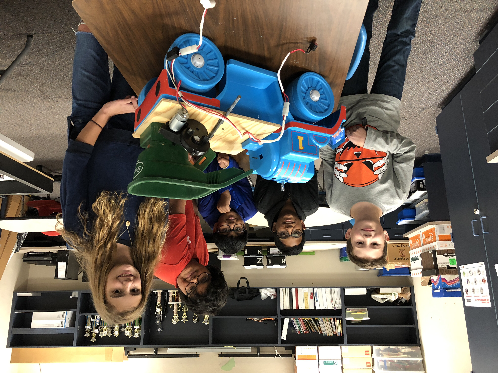

ARTPSASOEFMSS
*************

This project documents First Lego League Team Steve's Hydro Dynamics
project.  The repository contains code and electrical diagrams to
rebuild such a device as the ARTPSASOEFMSS.  What is a ARTPSASOEFMSS?  
Automatic Robot That Plows Snow and Spreads Out Environmentally Friendly
Melting Snow Stuff.  

`YouTube video <https://youtu.be/bUvHyPUca0o>`_ is now available of the team’s
skit along with video of the ARTPSASOEFMSS in action!
